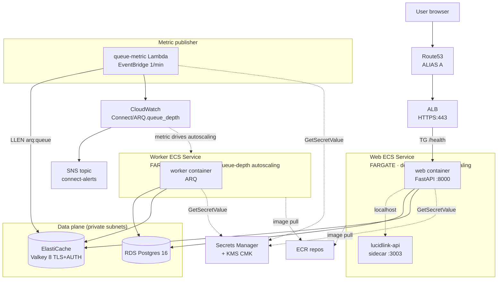

# Architecture diagram + decisions log — `aws-fargate`

Companion to `SPEC.md`. SPEC focuses on the *why* (ADRs); this file expands on the *what* with traffic-flow detail and a more visual diagram.

## Visual architecture

## Traffic flow — happy path

### Inbound HTTP request

1. User hits `https://connect.example.com/...`.
2. Route53 ALIAS A → ALB DNS name.
3. ALB terminates TLS via the ACM cert; HTTP request forwarded to the web target group.
4. Target group routes to a healthy web Fargate task on port 8000.
5. Web container handles the request; calls Postgres for state, Valkey for ARQ enqueue, lucidlink-api sidecar (localhost:3003) for LucidLink ops.
6. Web returns response → ALB → user.

### Job enqueue → execution

1. Web container calls `JobQueue.add_job(...)` which writes a job to ARQ's Valkey list (`arq:queue`).
2. `queue-metric` Lambda fires every minute, reads `LLEN arq:queue`, publishes `Connect/ARQ.connect_arq_queue_depth`.
3. ECS Service Auto Scaling target-tracks that metric: when avg-depth-per-worker > 5, scales out; when 0 for 5 min, scales in. Worker count: 0–8.
4. Worker pulls a job from the ARQ queue. Idempotency check: if `processed_jobs` table already has this job's ID, skip.
5. Worker executes import: customer S3 → lucidlink-api (in the web service, via internal cluster routing? No — worker doesn't have a sidecar; talks to the web service's lucidlink-api via service discovery).

   *Note: the lucidlink-api is currently a sidecar in the web Task Definition. Workers reach it via the web service ALB — this is suboptimal latency-wise. Future ADR may move it to its own dedicated `connect-prod-lucidlink-api` service with internal-facing service discovery.*
6. Worker writes job state back to Postgres.
7. SIGTERM during execution → ARQ finishes current job → exits clean within 120s `stopTimeout`.

### CI deploy

1. Developer pushes to `aws-fargate` (or pushes `v*` tag).
2. GitHub Actions: lint + test + terraform validate.
3. Build multi-arch images for connect-web + connect-worker, push to ECR with the commit SHA (or tag) as the image tag.
4. Register a new revision of the `connect-prod-migrate` task def with the new image, run it, wait for clean exit.
5. Register new revisions of `connect-prod-web` + `connect-prod-worker` task defs with the new image.
6. `aws ecs update-service --force-new-deployment` for both. `wait services-stable` for up to 15 min.
7. ALB drains old tasks (deregistration_delay=30s), spawns new ones, swaps target health.

## Decisions log

For full reasoning behind each, see `SPEC.md` §2.

| ADR | Decision | Date |
|---|---|---|
| 001 | Pivot from EKS Auto Mode to ECS Fargate | 2026-04-27 |
| 002 | External Lambda publishes ARQ queue depth (worker scale-to-zero requirement) | 2026-04-28 |
| 003 | Web on FARGATE, Worker on FARGATE_SPOT by default | 2026-04-28 |
| 004 | Migrations run as one-shot `aws ecs run-task`, not at task startup | 2026-04-28 |
| 005 | Caller-owned security groups (root composition defines them, modules accept SG IDs) | 2026-04-28 |
| 006 | Account-root key policy + IAM-side scoping for the connect-secrets CMK | 2026-04-28 |
| 007 | github-oidc trust scope: `aws-fargate` branch + `v*` tags only, scoped `iam:PassRole` | 2026-04-28 |

## Open questions / future ADRs

- **lucidlink-api co-location.** Currently bundled as a sidecar in the web task. Worker tasks don't have direct sidecar access, so any worker→lucidlink-api call routes via the web service which adds a hop and an ALB pass. Should split into a dedicated `connect-<env>-lucidlink-api` service with cluster-local service discovery.
- **Multi-region.** Single-region today. DR plan (`disaster-recovery.md`) accepts a region-out scenario as a manual restore from snapshots.
- **Per-customer tenancy at the infra layer.** The current model is single-deployment, multi-user-with-data-isolation in the app. If customer counts grow, infra-level multi-tenancy (separate VPCs, separate clusters) becomes a sizing question.
